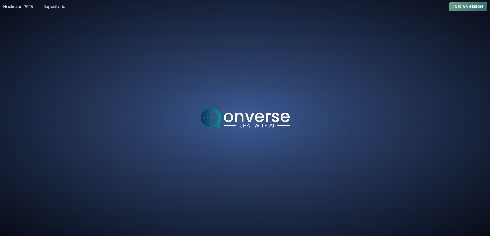
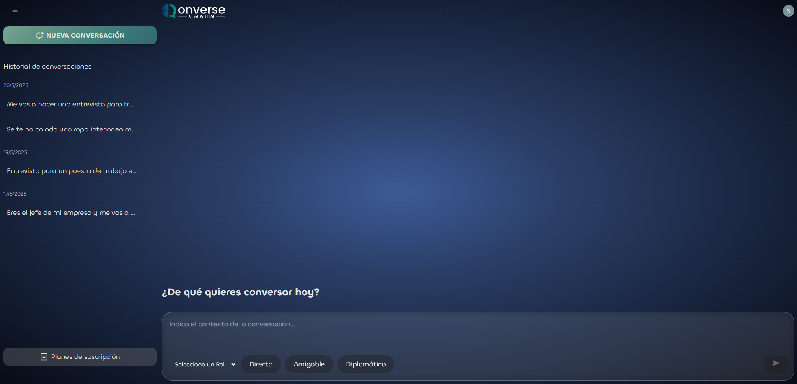

# Qonverse

## 💡 Descripción del proyecto: 
**Qonverse** es una aplicación web interactiva diseñada para ayudar a los usuarios a mejorar sus habilidades comunicativas a través de conversaciones simuladas con inteligencia artificial. El proyecto ha sido desarrollado por un equipo de dos personas utilizando las tecnologías **React**, **Firebase** y **Clerk**.

La IA, impulsada por **Gemini 2.0 Flash**, adopta distintos roles y comportamientos definidos por el usuario para mantener conversaciones naturales, coherentes y contextuales. A medida que la conversación avanza, la IA recuerda el contexto original y los últimos mensajes, manteniendo así la coherencia temática y emocional del diálogo.

Además de fomentar el entrenamiento dialéctico, Qonverse se ha diseñado con una experiencia de usuario clara, accesible y visualmente atractiva.

---

## 📖 Enlace a la demo:
Accede directamente a la App desplegada en Vercel:
👉[https://qonverse.vercel.app/](https://qonverse.vercel.app/)

---

## 📷 Capturas de pantalla

---

## 🥸 Explicación de cómo se ha utilizado Clerk: 

### Gestión de usuarios con Clerk
La aplicación web utiliza **Clerk** para gestionar la autenticación, el registro y el control de acceso de los usuarios. Gracias a su integración con React, hemos implementado:
- **Autenticación segura con correo electrónico.**
- **Botón de usuario y control de sesión en el header.**
- **Planes diferenciados según el tipo de usuario:**
    - **Plan gratuito:** hasta 3 conversaciones al día, con un límite de 10 mensajes por conversación.
    - **Plan premium:** acceso ilimitado y desbloqueo de nuevos roles y comportamientos.

La integración se llevó a cabo siguiendo la guía oficial de Clerk para React:
📒[https://clerk.com/docs/quickstarts/react](https://clerk.com/docs/quickstarts/react)

---

## 🔧 Tecnologías utilizadas:
- **Fontend:** React, TypeScript, CSS Modules
- **Backend & Storage:** Firebase Firestore
- **IA Conversacional:** Google AI 2.0 Flash API
- **Autenticación:** Clerk
- **Deployment:** Vercel

---

## 🌟 Características destacadas:
- Seleción de **rol** (jefe, cliente enfadado, entrevistador...) y **comportamiento** (amigable, seco, diplomático...).
- **Simulación realista** con efecto de escritura.
- **Historial persistente de chats**, ordenado por fecha.
- **Límites diarios** en el plan gratuito para incentivar el upgrade.
- **Protección de rutas** para garantizar la seguridad de acceso.

--- 

## Contacto
- Equipo: [@nazarbk](https://github.com/nazarbk) y [@davicornio](https://github.com/Davicornio)
- Proyecto abierto a mejoras y nuevas funcionalidades 🚀.

---

## Disclaimer
Este proyecto fue desarrollado en el contexto de la [hackathon](https://github.com/midudev/hackaton-clerk-2025?tab=readme-ov-file#%EF%B8%8F-c%C3%B3mo-participar-en-la-hackat%C3%B3n). Si bien está funcional y deployeado, no es una versión completa del producto.
